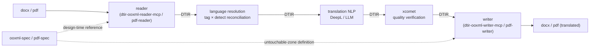
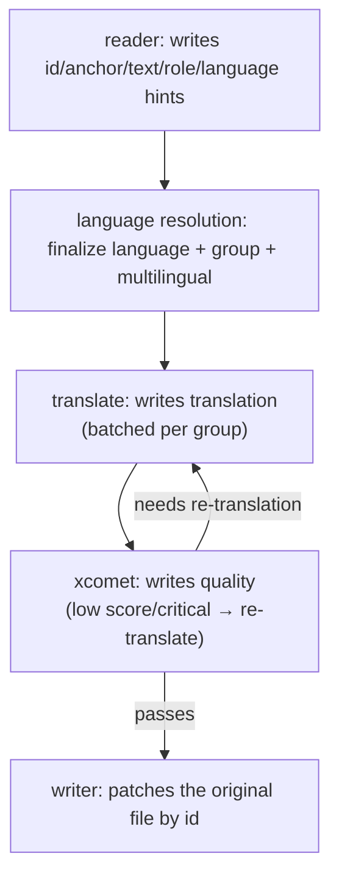
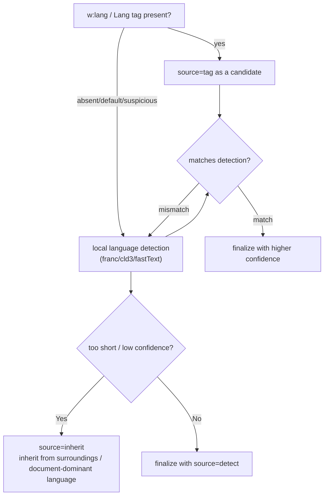
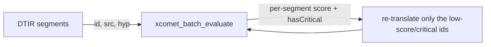

[日本語](./README.md) | **English**

# DTIR — Document Translation Intermediate Representation `v0.1`

The intermediate representation (IR) contract shared by a group of MCP servers, for translating
mixed-language documents (`.docx` / `.pdf`) **without breaking formatting, pagination, or image positions**.

> Origin: a question on the DeepL Bridges community — "I have a single docx with Dutch, French and German
> mixed together and I want it all in English." DeepL assumes "one file = one source language" and does not
> support this natively on the document side. We solve it with a **reader → language resolution → translation NLP
> → verification → writer** pipeline. DTIR is its backbone.

## 1. Role — why make the "intermediate representation" the contract

To connect four MCP servers (`ooxml-spec` / `dtir-ooxml-reader-mcp` / `dtir-ooxml-writer-mcp` / `pdf-writer`)
and existing assets (`pdf-reader` / `deepl` / `xcomet`) in a **loosely coupled** way, we fix only the data
format that flows between stages — DTIR — and leave each MCP's internal implementation free.



**Three core design principles**

1. **Format-independent** — both `docx` and `pdf` emit the same DTIR and ride the same pipeline.
2. **Translation-engine-independent** — the middle can be DeepL or an LLM, swappable. reader/writer know nothing about translation.
3. **Lossless** — the whole document is never streamed into the IR. The reader emits only a "segment table" (id + text + hints),
   and the writer **patches the original file by `id`**. `sectPr`, DrawingML (images), and TOC fields
   **never enter the IR in the first place = they cannot break by construction**.

## 2. Data model

The top level is `IRDocument`; the body is `IRSegment[]`.
Type definitions are in [`src/types.ts`](./src/types.ts); the validation schema is in [`schema/dtir-0.1.schema.json`](./schema/dtir-0.1.schema.json).

### IRDocument

| Field                   | Meaning                                                                                              |
| ----------------------- | ---------------------------------------------------------------------------------------------------- |
| `irVersion`             | Contract version (`"0.1"`)                                                                            |
| `source`                | Base file info (`format` / `fileName` / `sha256` / `byteSize`). `sha256` prevents writer mismatches  |
| `language.default`      | Container default language (docx `settings.xml` / pdf catalog `/Lang`)                               |
| `language.target`       | The job's translation target (e.g. `"en-GB"`)                                                        |
| `language.multilingual` | Result of multilingual detection (`isMultilingual` / `score` / `method` / `languagesPresent`)        |
| `segments`              | The segment table                                                                                    |
| `stats`                 | `segmentCount` / `translatableCount` / `groupCount`                                                  |
| `extensions`            | Format-specific opaque bag (optional)                                                                |

### IRSegment

| Field                         | Meaning                                                              | Key point for not breaking                                                       |
| ----------------------------- | ------------------------------------------------------------------- | -------------------------------------------------------------------------------- |
| `id`                          | Stable anchor key. **Invariant across all stages.** writer's patch key | **Derived deterministically from the anchor; invariant across re-runs** (§3)  |
| `order`                       | Reading order                                                       |                                                                                  |
| `anchor`                      | Locator. Written by reader, read by writer. **Opaque only to the middle stages** | The shape of `ref` requires full agreement between reader/writer; the `*-spec` MCPs define it (§3) |
| `role`                        | `heading`/`body`/`toc`/`footnote`…                                  | Hint for short-text inheritance and context-aware translation                    |
| `text.source`                 | Source text to translate (concatenated runs)                       |                                                                                  |
| `text.hasInlineFormatting`    | Whether it spans multiple runs/formats                             | If true, writer redistributes the translation across runs (**run-splitting problem**). v0.1 default is collapse |
| `text.runs?`                  | Optional, forward-compatible. Each run's offset within source `{runId,start,end}` | For the v0.2 tag-aware writer. The v0.1 writer may ignore it             |
| `text.space`                  | `xml:space` equivalent (preserve leading/trailing whitespace)      |                                                                                  |
| `language`                    | `{value, confidence, source, candidates?}`                          | **Tags are hints, not facts.** See §4                                            |
| `translatable` / `skipReason` | Whether translatable / reason for exclusion                        | `field`/`zxx`/`numeric` are never touched by the writer                          |
| `group`                       | Batch aggregation key (usually = source_lang)                      | **The lever for cost reduction.** See §5                                         |
| `context`                     | ids of `prev`/`next`/`parent`                                       | Context-aware translation and short-text inheritance                             |
| `translation`                 | Filled by translate (`null` if untranslated)                       |                                                                                  |
| `quality`                     | Filled by xcomet (`null` if not evaluated)                         |                                                                                  |

## 3. Per-stage read/write responsibilities (= the heart of the contract)

Each stage **fills only its own columns and never destroys values from earlier stages** (append-only).
The sole exception is the refinement of `language` / `translatable` by language resolution.

| Field                                         | reader   | lang. resolution | translate |  xcomet   |  writer   |
| --------------------------------------------- | :------: | :--------------: | :-------: | :-------: | :-------: |
| `id` / `order` / `anchor` / `role` / `text.*` |  **W**   |        –         |     –     |     –     |     R     |
| `language` (hint)                             |    W     |  **W** (final)   |     R     |     –     |     –     |
| `translatable` / `skipReason`                 | W (init) | **W** (refined)  |     R     |     –     |     R     |
| `group`                                       |    –     |      **W**       |     R     | R (batch) |     –     |
| `context`                                     |  **W**   |        –         |     R     |     –     |     –     |
| `translation`                                 |    –     |        –         |   **W**   |     R     |     R     |
| `quality`                                     |    –     |        –         |     –     |   **W**   | R (gate)  |

> **Invariants**
>
> - **id determinism**: `id` is derived deterministically from `anchor` (docx: hash of part + XPath; pdf: `page+mcid`)
>   and is **invariant even if the reader is re-run on the same input**. Order-dependent serial numbers are forbidden
>   (if one paragraph is added, every id shifts and incremental translation/caching breaks). Invariant across all stages.
> - The writer **does not touch** `translation.text` when `translatable:true`, nor the source when `false`.
> - **Run-splitting writer default (v0.1)**: when `text.hasInlineFormatting:true`, the writer uses **collapse** ——
>   it discards intra-paragraph formatting and applies the dominant run's (the first) `rPr` to the whole translated paragraph.
>   To preserve intra-paragraph formatting, the reader fills the optional `text.runs[]` (offsets within source) and
>   the v0.2+ tag-aware writer redistributes (schema-compatible).
> - **Agreement scope of anchor.ref**: opaque to the middle stages (language resolution/translation/xcomet) —
>   **must not be modified, pass-through only**. But since reader and writer are separate MCPs, the shape of `ref`
>   requires **full agreement**, and that contract is defined versioned by `ooxml-spec` / `pdf-spec`
>   (the top-level schema stays a generic object).



## 4. Language is not a "value" but "hint + confidence + source"

Neither docx `<w:lang>` nor pdf `/Lang` **is guaranteed to be present, and when present is often wrong**
(Word auto-assigns it from the keyboard language at input time; an untagged pdf has zero per-token language).
So language is always carried as `{value, confidence, source}` and **reconciled by tag × local detection**.



- Rough confidence ordering of `source`: `declared` > `tag` (explicit) ≈ `detect` (high confidence) > `default` > `inherit`
- Use BCP 47 reserved values: `zxx` (non-linguistic) = `skipReason:"non-linguistic-zxx"`; empty string = language unknown → detection fallback

## 5. `group` solves the cost explosion

The original asker's core worry: "calling the API per paragraph with an empty `source_lang` makes the
**number of calls and the cost explode**." We put the locally-resolved language into `group` and
**aggregate same-language segments into a single translation call**.

```
paragraphs with group="nl-NL" → one call → en-GB
paragraphs with group="fr-FR" → one call → en-GB
paragraphs with group="de-DE" → one call → en-GB
```

This converges to a batch **per language**, not per paragraph. Detection is not only for correctness — it is the main lever for cost reduction.

> **Note: "one call" is an array, not a concatenation.** Like DeepL `/translate`'s `text[]`, we bundle into
> **an array that preserves segment boundaries** in one request. If you concatenate the source into a single
> string and send it, the correspondence between translation and `id` breaks and the writer can no longer patch.
> Aggregation reduces the number of requests; it does not merge text.

## 6. xcomet needs neither `group` nor `lang`

`@shuji-bonji/xcomet-mcp`'s `xcomet_*` only require `source` / `translation`; `source_lang` / `target_lang`
are **optional** (the multilingual encoder embeds the sentences directly).
Each DTIR segment can flow straight into `pairs[] = {source: text.source, translation: translation.text}`.
→ The fruits of language resolution are **fully used on the translate side and ignored as metadata on the xcomet side**.
The same IR feeds both with no extra work.



## 7. DTIR as seen by each MCP

| MCP                          | Relationship to DTIR                                                                      |
| ---------------------------- | ----------------------------------------------------------------------------------------- |
| `dtir-ooxml-reader-mcp`      | Parses docx and **produces** DTIR (`anchor`/`text`/language hints/`context`)              |
| `pdf-reader` (existing)      | Produces DTIR from pdf (`anchor` is page/mcid/bbox based)                                  |
| `dtir-ooxml-writer-mcp`      | Takes DTIR + the original docx and **outputs** a translated docx by patching by `id`      |
| `pdf-writer` (new, hardest)  | Same for pdf. The core challenge is layout re-composition under text expansion/shrinkage  |
| `ooxml-spec` / `pdf-spec`    | Supply the **primary source** for the reader/writer's "untouchable zone" decisions (never touch DTIR directly) |
| `deepl` (existing)           | Fills `translation` per `group`                                                           |
| `xcomet` (existing)          | Fills `quality`                                                                           |

## 8. Versioning

- `irVersion` semantics: adding a field (backward-compatible) = minor; a breaking change = major.
- The reader always outputs `irVersion`; the writer **rejects** a major it does not understand.
- `v0.1` targets the minimal docx/pdf use case (mixed-language → single language). Full coverage of tables, footnotes, and headers is worked out in implementation.

### Known limitations (v0.1)

- **Intra-paragraph language switching is not captured.** `language` is per segment, so a sentence that switches
  Dutch→French within a single `<w:p>` is rounded to one language for the whole segment. A reasonable simplification,
  but cases that need run-level language resolution are planned for v0.2 via the `runs` + per-run `language` extension.
- **Inline formatting is lost by default** (the collapse above). Preserving intra-paragraph formatting such as bold/color
  is deferred to a tag-aware writer that fills `runs` (v0.2+).

## 9. File layout

```
doc-translation-ir/
├── README.md                         # this design document (Japanese)
├── README.en.md                      # this file (English)
├── src/types.ts                      # TypeScript type definitions (source of truth)
├── schema/dtir-0.1.schema.json       # JSON Schema 2020-12 (for validation)
└── examples/
    ├── docx-multilang.dtir.json      # NL/FR/DE → EN, with field/numeric exclusions
    └── pdf-untagged.dtir.json        # untagged pdf, detection-driven, no default language
```
