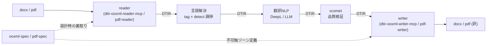
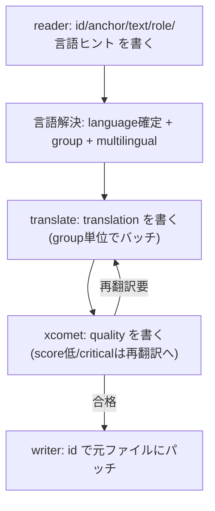
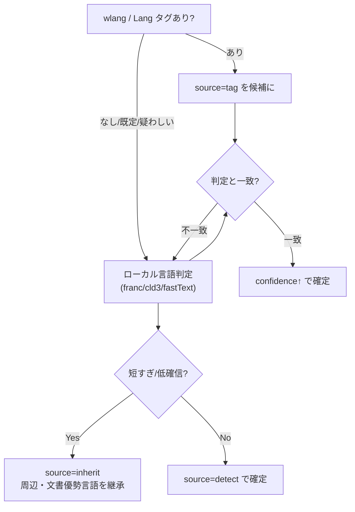
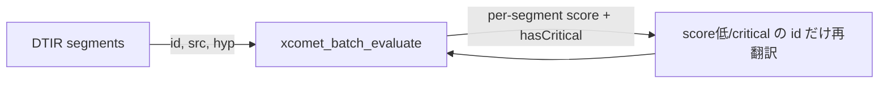

# DTIR — Document Translation Intermediate Representation `v0.1`

混在言語ドキュメント（`.docx` / `.pdf`）を **書式・ページ・画像位置を崩さずに** 翻訳するための、
MCP 群が共有する中間表現（IR）契約。

> 由来: DeepL Bridges コミュニティの相談「1ファイルに蘭・仏・独が混在した docx を全部英語にしたい」。
> DeepL は「1ファイル＝1ソース言語」前提で、ドキュメント側ではネイティブ対応していない。
> これを **reader → 言語解決 → 翻訳NLP → 検証 → writer** のパイプラインで解く。その背骨が DTIR。

## 1. 役割 — なぜ「中間表現」を契約にするのか

4 つの MCP（`ooxml-spec` / `dtir-ooxml-reader-mcp` / `dtir-ooxml-writer-mcp` / `pdf-writer`）と、
既存資産（`pdf-reader` / `deepl` / `xcomet`）を **疎結合** につなぐため、
ステージ間を流れるデータ形式＝ DTIR だけを固定し、各 MCP の内部実装は自由にする。



**設計の核心 3 点**

1. **フォーマット非依存** — `docx` も `pdf` も同じ DTIR を吐き、同じパイプラインに乗る。
2. **翻訳エンジン非依存** — 中間は DeepL でも LLM でも差し替え可。reader/writer は翻訳を知らない。
3. **ロスレス** — 文書全体を IR に流さない。reader は「セグメント表（id＋テキスト＋ヒント）」だけ出し、
   writer は **元ファイルを基板に `id` でパッチ**。`sectPr`・DrawingML（画像）・目次フィールドは
   **そもそも IR に乗らない＝原理的に崩れない**。

## 2. データモデル

トップは `IRDocument`、本体は `IRSegment[]`。
型定義は [`src/types.ts`](./src/types.ts)、検証スキーマは [`schema/dtir-0.1.schema.json`](./schema/dtir-0.1.schema.json)。

### IRDocument

| フィールド              | 意味                                                                                                 |
| ----------------------- | ---------------------------------------------------------------------------------------------------- |
| `irVersion`             | 契約バージョン（`"0.1"`）                                                                            |
| `source`                | 基板ファイル情報（`format` / `fileName` / `sha256` / `byteSize`）。`sha256` は writer の取り違え防止 |
| `language.default`      | コンテナ既定言語（docx `settings.xml` / pdf catalog `/Lang`）                                        |
| `language.target`       | ジョブの翻訳先（例 `"en-GB"`）                                                                       |
| `language.multilingual` | 多言語判定の結果（`isMultilingual` / `score` / `method` / `languagesPresent`）                       |
| `segments`              | セグメント表                                                                                         |
| `stats`                 | `segmentCount` / `translatableCount` / `groupCount`                                                  |
| `extensions`            | フォーマット固有の不透明バッグ（任意）                                                               |

### IRSegment

| フィールド                    | 意味                                                                | 崩さないための要点                                                            |
| ----------------------------- | ------------------------------------------------------------------- | ----------------------------------------------------------------------------- |
| `id`                          | 安定アンカーキー。**全ステージで不変**。writer のパッチキー         | **anchor から決定的に導出・再実行で不変**（§3 不変条件）                      |
| `order`                       | 読み順                                                              |                                                                               |
| `anchor`                      | ロケータ。reader が書き writer が読む。**中間ステージにのみ不透明** | `ref` の形は reader/writer 間で完全合意が要り、`*-spec` MCP が規定（§3）      |
| `role`                        | `heading`/`body`/`toc`/`footnote`…                                  | 短文継承・文脈翻訳のヒント                                                    |
| `text.source`                 | 翻訳対象の原文（ラン連結）                                          |                                                                               |
| `text.hasInlineFormatting`    | 複数ラン/書式にまたがるか                                           | true なら writer が訳文をラン再配分（**ラン分断問題**）。v0.1 既定は collapse |
| `text.runs?`                  | 任意・前方互換。各ランの source 内オフセット `{runId,start,end}`    | v0.2 の tag-aware writer 用。v0.1 writer は無視可                             |
| `text.space`                  | `xml:space` 相当（前後空白保持）                                    |                                                                               |
| `language`                    | `{value, confidence, source, candidates?}`                          | **タグは事実でなくヒント**。§4 参照                                           |
| `translatable` / `skipReason` | 翻訳対象か／除外理由                                                | `field`/`zxx`/`numeric` は writer が一切触らない                              |
| `group`                       | バッチ集約キー（通常 = source_lang）                                | **コスト削減のレバー**。§5 参照                                               |
| `context`                     | `prev`/`next`/`parent` の id                                        | 文脈付き翻訳・短文継承                                                        |
| `translation`                 | translate が埋める（未翻訳は `null`）                               |                                                                               |
| `quality`                     | xcomet が埋める（未評価は `null`）                                  |                                                                               |

## 3. ステージ別の読み書き責務（＝契約の本体）

各ステージは **自分の列だけ埋め、先行ステージの値を破壊しない**（追記式）。
唯一の例外は言語解決による `language` / `translatable` の精緻化。

| フィールド                                    | reader  |  言語解決   | translate |  xcomet   |  writer   |
| --------------------------------------------- | :-----: | :---------: | :-------: | :-------: | :-------: |
| `id` / `order` / `anchor` / `role` / `text.*` |  **W**  |      –      |     –     |     –     |     R     |
| `language`（ヒント）                          |    W    | **W**(確定) |     R     |     –     |     –     |
| `translatable` / `skipReason`                 | W(初期) | **W**(精緻) |     R     |     –     |     R     |
| `group`                                       |    –    |    **W**    |     R     | R(バッチ) |     –     |
| `context`                                     |  **W**  |      –      |     R     |     –     |     –     |
| `translation`                                 |    –    |      –      |   **W**   |     R     |     R     |
| `quality`                                     |    –    |      –      |     –     |   **W**   | R(ゲート) |

> **不変条件**
>
> - **id 決定性**: `id` は `anchor` から決定的に導出（docx: part＋XPath のハッシュ、pdf: `page+mcid`）し、
>   **同一入力で reader を再実行しても不変**。順序依存の連番は禁止（段落が1つ増えると全 id がズレ、
>   増分翻訳・キャッシュが破綻する）。全ステージで不変。
> - writer は `translatable:true` のとき `translation.text` を、`false` のとき原文を**触らない**。
> - **ラン分断の writer 既定（v0.1）**: `text.hasInlineFormatting:true` のとき writer は **collapse** ——
>   段内書式を捨て、優勢ラン（先頭）の `rPr` を訳文段落全体に適用する。
>   段内書式を保ちたい場合は reader が任意の `text.runs[]`（source 内オフセット）を埋め、
>   v0.2 以降の tag-aware writer が再配分する（スキーマ非破壊）。
> - **anchor.ref の合意範囲**: 中間ステージ（言語解決/翻訳/xcomet）にとっては不透明・**改変禁止・パススルー**。
>   ただし reader と writer は別 MCP なので `ref` の形には**完全合意が必要**で、その契約は
>   `ooxml-spec` / `pdf-spec` が versioned に規定する（トップ schema は generic object のまま）。



## 4. 言語は「値」ではなく「ヒント＋確信度＋出所」

docx `<w:lang>` も pdf `/Lang` も **必ず付くとは限らず、付いても誤りが多い**
（Word は入力時のキーボード言語で自動付与、pdf は untagged だと個別言語ゼロ）。
そこで言語は必ず `{value, confidence, source}` で持ち、**タグ × ローカル判定で調停**する。



- `source` の信頼度序列の目安: `declared` > `tag`(明示) ≈ `detect`(高確信) > `default` > `inherit`
- BCP 47 予約値を活用: `zxx`（非言語）= `skipReason:"non-linguistic-zxx"`、空文字列 = 言語不明 → 判定フォールバック

## 5. `group` がコスト爆発を解く

元の相談者の本懸念は「段落ごとに `source_lang` 空で API を叩くと**呼び出し数とコストが爆発**」。
ローカル判定で確定した言語を `group` に入れ、**同一言語をまとめて 1 回の翻訳呼び出しに集約**する。

```
group="nl-NL" の段落 → まとめて 1 コール → en-GB
group="fr-FR" の段落 → まとめて 1 コール → en-GB
group="de-DE" の段落 → まとめて 1 コール → en-GB
```

段落数ぶんではなく **言語数ぶん**のバッチに収束する。判定は正しさのためだけでなく、コスト削減の主レバー。

> **注意: 「1 コール」は配列であって連結ではない。** DeepL `/translate` の `text[]` のように
> **セグメント境界を保った配列**で 1 リクエストにまとめる。原文を1本に連結して投げると、
> 訳文と `id` の対応が崩れ writer がパッチできなくなる。集約はリクエスト数の削減であり、テキストの結合ではない。

## 6. xcomet は `group` も `lang` も要らない

`@shuji-bonji/xcomet-mcp` の `xcomet_*` は `source` / `translation` のみ必須で
`source_lang` / `target_lang` は **任意**（多言語エンコーダが文を直接埋め込むため）。
DTIR の各セグメントはそのまま `pairs[] = {source: text.source, translation: translation.text}` に流せる。
→ 言語解決の成果は **translate 側でフル活用、xcomet 側はメタとして無視**。同じ IR が両方を素通りで養う。



## 7. 各 MCP から見た DTIR

| MCP | DTIR との関係 |
|||
| `dtir-ooxml-reader-mcp` | docx を解析し DTIR を**生成**（`anchor`/`text`/言語ヒント/`context`） |
| `pdf-reader`（既存） | pdf から DTIR を生成（`anchor` は page/mcid/bbox 系） |
| `dtir-ooxml-writer-mcp` | DTIR ＋ 元 docx を入力に、`id` でパッチして訳 docx を**出力** |
| `pdf-writer`（新規・最難） | 同上を pdf で。文字数伸縮のレイアウト再構成が本丸 |
| `ooxml-spec` / `pdf-spec` | reader/writer の「不可触ゾーン」判定の**一次情報**を供給（DTIR には直接触れない） |
| `deepl`（既存） | `group` 単位で `translation` を埋める |
| `xcomet`（既存） | `quality` を埋める |

## 8. バージョニング

- `irVersion` セマンティクス: フィールド追加（後方互換）= マイナー、破壊的変更 = メジャー。
- reader は `irVersion` を必ず出力、writer は理解できない major を**拒否**する。
- `v0.1` は docx/pdf の最小ユースケース（混在言語→単一言語）を対象。表・脚注・ヘッダの網羅は実装で詰める。

### 既知の制限（v0.1）

- **段落内での言語切替は拾えない**。`language` はセグメント単位なので、1つの `<w:p>` 内で
  蘭→仏のように切り替わる文章はセグメント全体で1言語に丸められる。割り切りとして妥当だが、
  ラン単位の言語解決が要るケースは v0.2 で `runs` ＋ ラン別 `language` 拡張で対応する想定。
- **インライン書式は既定で失われる**（上記 collapse）。太字・色などの段内書式保持は `runs` を
  埋めた tag-aware writer（v0.2 以降）まで保留。

## 9. ファイル構成

```
doc-translation-ir/
├── README.md                         # この設計ドキュメント
├── src/types.ts                      # TypeScript 型定義（正本）
├── schema/dtir-0.1.schema.json       # JSON Schema 2020-12（検証用）
└── examples/
    ├── docx-multilang.dtir.json      # 蘭/仏/独 → 英、フィールド・数値の除外例
    └── pdf-untagged.dtir.json        # untagged pdf、detect 主体・既定言語なし
```
