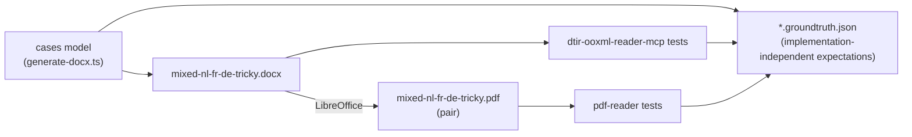

[日本語](./README.md) | **English**

# DTIR fixtures — the test-driven foundation

Regression-test fixtures for `dtir-ooxml-reader-mcp` / `pdf-reader` / `*-writer`.
Because the docx and the expected values (groundtruth) are **generated together from a single model**,
the input and the test expectations never drift apart.



## The "nasty cases" we planted

| key                | The gap it checks                                          | Expectation                                          |
| ------------------ | ---------------------------------------------------------- | ---------------------------------------------------- |
| `heading-nl`       | A correct `<w:lang>` tag                                   | `nl-NL` / source=tag / translatable                  |
| `body-fr-split`    | **One sentence split across 3 runs** (leading bold)       | `fr-FR` / `runCount:3` / `hasInlineFormatting:true`  |
| `body-de-notag`    | **Tag missing → inherits default nl-NL, but content is German** | `de-DE` / source=**detect** (overrides tag/default) |
| `body-ja`          | **Japanese paragraph** (`w:eastAsia=ja-JP` only, no `w:val`) | `ja-JP` / source=**detect** (CJK detection)        |
| `toc-title`        | The TOC's **title heading** is visible text               | `nl-NL` / translatable (distinct from the field)     |
| `toc-field-cache`  | **Complex field** begin/instrText/separate/cache/end      | translatable=false / skip=`field`                    |
| `mixed-script`     | Latin + Han mixed (`w:val` + `w:eastAsia`)                | `en-US` / scripts=[Latin,Han]                        |
| `numeric`          | Numbers/symbols only                                       | translatable=false / skip=`numeric`                  |
| `header-text`      | A miss **outside document.xml** (header1.xml)             | `nl-NL` / translatable / part=header                 |
| `footer-pagefield` | A `PAGE` field inside the footer                          | translatable=false / skip=`field`                    |

The container default language is `nl-NL` (`styles.xml`'s `docDefaults/rPrDefault`).
`body-de-notag` inherits this default, so it is the litmus test for **whether local language detection can override the tag/default**.

## groundtruth is implementation-independent

The `id` hash and the exact `anchor` path are left to the reader implementation; the groundtruth declares only
the **meaning** the reader must satisfy (`expectSource` / `expectLang` / `expectLangSource` / `translatable` /
`skipReason` / `runCount` / `scripts` / `part`). The reader test identifies a segment by partial match of
`expectSource` + part + role, then checks language resolution and translatable/skip/run count. Separately it
asserts **id determinism** (run the reader twice, ids unchanged) and **anchor round-trip** (the writer can patch).

## Regeneration

```sh
# Generate the docx and groundtruth (output to <outDir>/docx/)
tsx fixtures/generate-docx.ts fixtures

# Generate the pdf pair (LibreOffice required). Doubles as a docx validity check
soffice --headless --convert-to pdf \
  --outdir fixtures/pdf fixtures/docx/mixed-nl-fr-de-tricky.docx
```

## Generated artifacts

```
fixtures/
├── generate-docx.ts                          # single model → docx + groundtruth
├── docx/
│   ├── mixed-nl-fr-de-tricky.docx            # input fixture (hand-built OOXML)
│   └── mixed-nl-fr-de-tricky.docx.groundtruth.json
└── pdf/
    └── mixed-nl-fr-de-tricky.pdf             # same-content pair (LibreOffice output)
```

## Verified at generation time

- The docx is a valid zip and every OOXML part is well-formed XML
- LibreOffice can open the docx and convert it to pdf (= Word-compatible validity)
- The pdf renders all languages — nl/fr/de/ja + the header text
- The semantic check reuses [`../src/validate-dtir.ts`](../src/validate-dtir.ts) (run against the reader's DTIR output)
