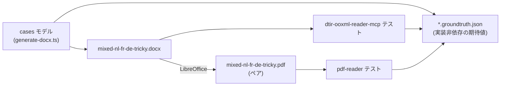

**日本語** | [English](./README.en.md)

# DTIR fixtures — テスト駆動の土台

`dtir-ooxml-reader-mcp` / `pdf-reader` / `*-writer` の回帰テスト用フィクスチャ。
**単一モデルから docx と期待値(groundtruth)を同時生成**するので、入力とテスト期待値がドリフトしない。



## 仕込んだ「意地悪ケース」

| key                | 検証する穴                                                 | 期待                                                |
| ------------------ | ---------------------------------------------------------- | --------------------------------------------------- |
| `heading-nl`       | 正しい `<w:lang>` タグ                                     | `nl-NL` / source=tag / 翻訳対象                     |
| `body-fr-split`    | **1文が3ランに分断**（先頭ボールド）                       | `fr-FR` / `runCount:3` / `hasInlineFormatting:true` |
| `body-de-notag`    | **タグ欠落で既定 nl-NL を継承するが内容は独語**            | `de-DE` / source=**detect**（tag/defaultを覆す）    |
| `body-ja`          | **日本語段落**（`w:eastAsia=ja-JP` のみ・`w:val` 無し）    | `ja-JP` / source=**detect**（CJK 判定）             |
| `toc-title`        | TOC の**タイトル見出し**は可視テキスト                     | `nl-NL` / 翻訳対象（フィールドと別物）              |
| `toc-field-cache`  | **複合フィールド** begin/instrText/separate/キャッシュ/end | translatable=false / skip=`field`                   |
| `mixed-script`     | ラテン＋漢字混在（`w:val`＋`w:eastAsia`）                  | `en-US` / scripts=[Latin,Han]                       |
| `numeric`          | 数値・記号のみ                                             | translatable=false / skip=`numeric`                 |
| `header-text`      | **document.xml 以外**（header1.xml）の取りこぼし           | `nl-NL` / 翻訳対象 / part=header                    |
| `footer-pagefield` | フッタ内 `PAGE` フィールド                                 | translatable=false / skip=`field`                   |

コンテナ既定言語は `nl-NL`（`styles.xml` の `docDefaults/rPrDefault`）。
`body-de-notag` はこの既定を継承してしまうため、**ローカル言語判定が tag/default を覆せるか**の踏み絵になる。

## groundtruth は実装非依存

`id` ハッシュや厳密な `anchor` パスは reader 実装に委ね、groundtruth は
「reader が満たすべき**意味**」だけを宣言する（`expectSource` / `expectLang` /
`expectLangSource` / `translatable` / `skipReason` / `runCount` / `scripts` / `part`）。
reader テストは `expectSource` の部分一致＋part＋role でセグメントを同定し、言語解決と
translatable/skip/ラン数を突き合わせる。あわせて **id 決定性**（reader を2回流して id 不変）と
**anchor ラウンドトリップ**（writer がパッチできる）を別途アサートする。

## 再生成

```sh
# docx と groundtruth を生成（<outDir>/docx/ に出力）
tsx fixtures/generate-docx.ts fixtures

# pdf ペアを生成（LibreOffice 必要）。docx の妥当性検証も兼ねる
soffice --headless --convert-to pdf \
  --outdir fixtures/pdf fixtures/docx/mixed-nl-fr-de-tricky.docx
```

## 生成物

```
fixtures/
├── generate-docx.ts                          # 単一モデル → docx + groundtruth
├── docx/
│   ├── mixed-nl-fr-de-tricky.docx            # 入力フィクスチャ（手組み OOXML）
│   └── mixed-nl-fr-de-tricky.docx.groundtruth.json
└── pdf/
    └── mixed-nl-fr-de-tricky.pdf             # 同一内容のペア（LibreOffice 出力）
```

## 検証済み事項（生成時）

- docx は valid zip、全 OOXML パートが XML well-formed
- LibreOffice が docx を開いて pdf 化できる（＝Word 互換の妥当性）
- pdf に nl/fr/de/ja＋ヘッダの全言語テキストがレンダリングされる
- 意味検査は [`../src/validate-dtir.ts`](../src/validate-dtir.ts) を流用（reader 出力 DTIR に対して実行）
